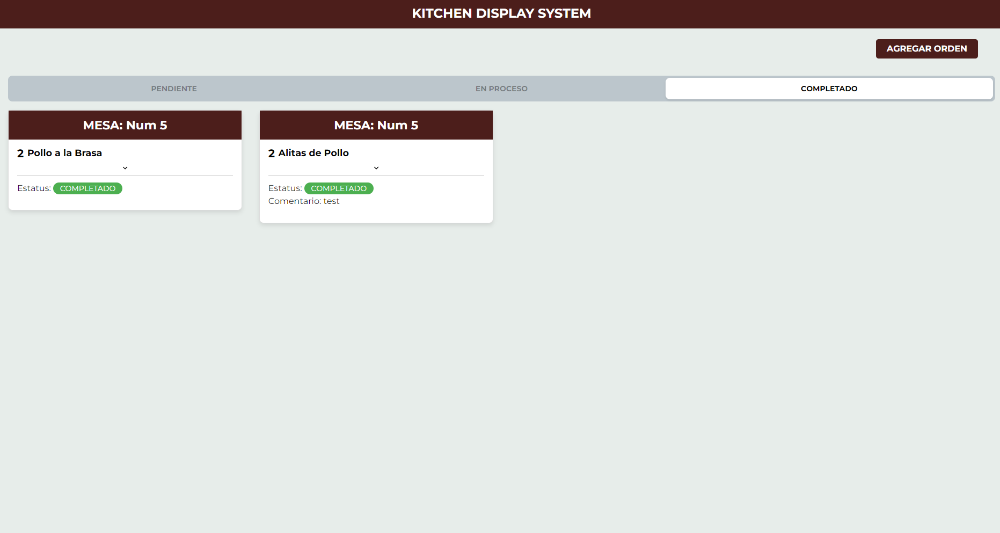
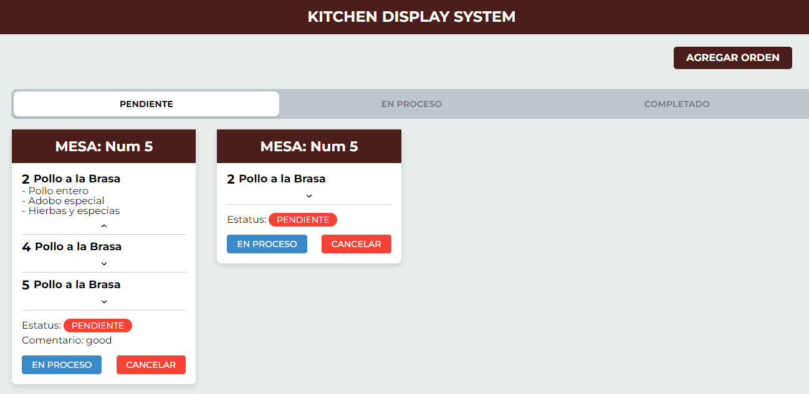
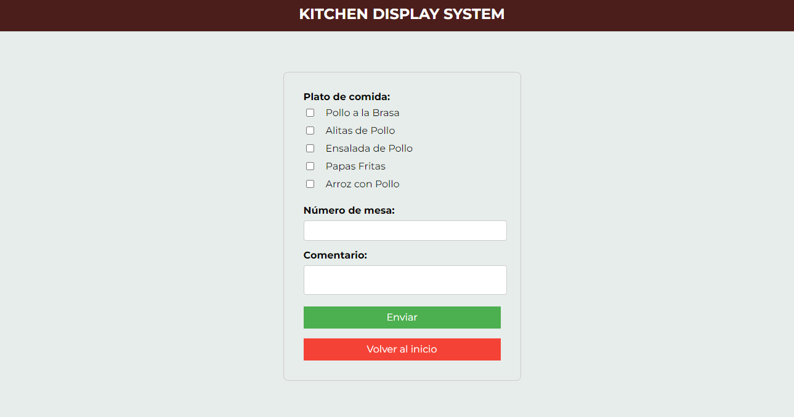

<h1 align="center">Welcome to KITCHEN DISPLAY SYSTEM 👋</h1>
<p>
  
</p>

> Propuesta de proyecto CRUD para la gestión de comidas: un sistema que permita añadir platos, visualizarlos instantáneamente por el chef y llevar a cabo su preparación en tiempo real.



### ✨ [Demo](https://test-id-iwcw.onrender.com/)

## Install

```sh
yarn install
```

### Objetivo:

Desarrollar una aplicación web de Kitchen Display System (KDS) utilizando React.js con Styled Components, React Hooks, Redux y TypeScript.

### Descripcion:

El aplicativo tiene 3 filtros, donde se puede ver los PENDIENTES, EN PROCESO y COMPLETADO, asimismo cada pedido, muestra los ingredientes que lleva, asimismo la cantidad, el estatus y un comentario a considerar por el chef.


Por otro lado, hay un formulario para agregar una nueva orden, con sus respectivas validaciones


## Author

👤 **Marcos Alanya**

* Website: https://marcos-alanya-portafolio.vercel.app/
* Github: [@MarcosAlanya19](https://github.com/MarcosAlanya19)
* LinkedIn: [@marcosAlanya19](https://linkedin.com/in/marcosAlanya19)
